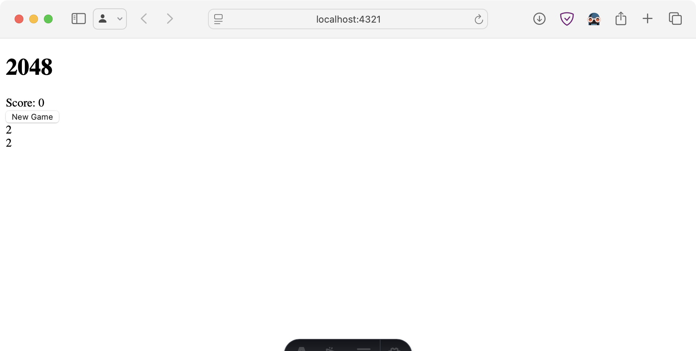
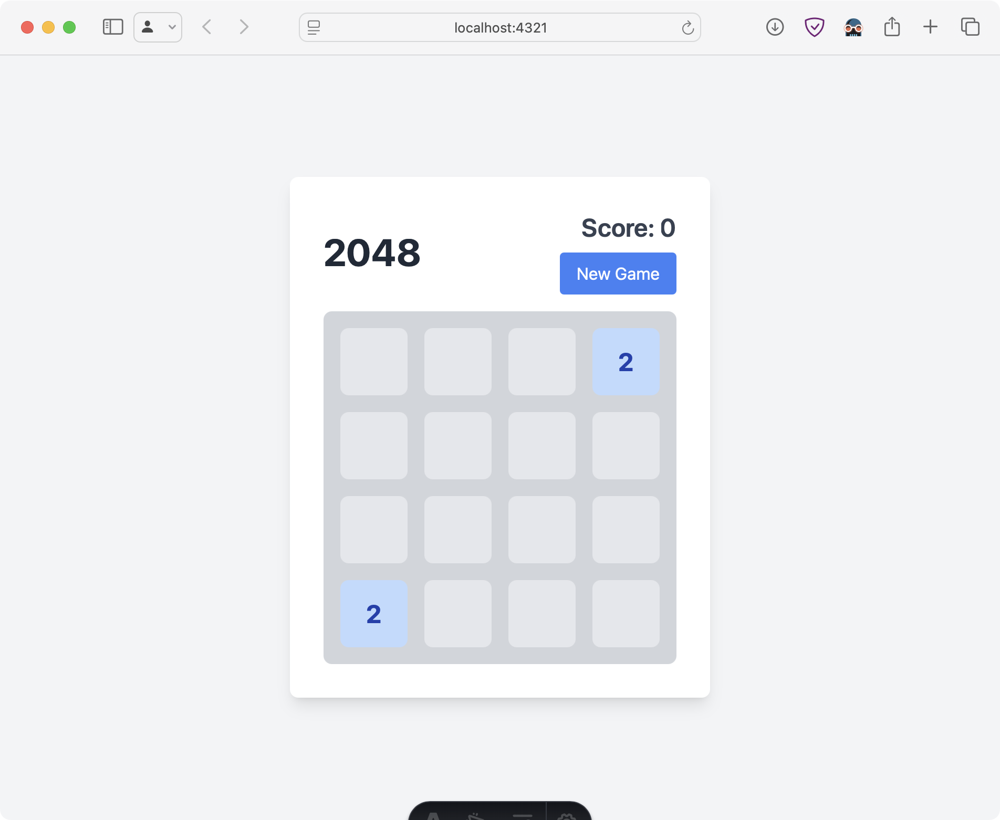

| Property    | Value                          |
| ----------- | ------------------------------ |
| Environment | Windsurf (Cascade, Write mode) |
| Model       | Claude 3.5 Sonnet              |

# Step 1: Generate the project

I did not do multiple attempts here.

> make a playable 2048 game with smooth animations via Framer Motion and React,
> in an Astro app, using Tailwind CSS"

Even though Cascade was in Write mode, it just gave me instructions to create
the project, including generated code, but expected me to do it manually. The
code in this repo is that generated code, manually added as instructed by
Claude.

# Step 2: Code cleanup

## [Attempt 1](https://github.com/lynx-ai-experiments/cascade-make-2048-astro-react/blob/step2-att1-cleanup/PROMPTS.md)

## [Attempt 2](https://github.com/lynx-ai-experiments/cascade-make-2048-astro-react/blob/step2-att2-cleanup/PROMPTS.md)

## [Attempt 3](https://github.com/lynx-ai-experiments/cascade-make-2048-astro-react/blob/step2-att3-cleanup/PROMPTS.md)

## [Attempt 4](https://github.com/lynx-ai-experiments/cascade-make-2048-astro-react/blob/step2-att4-cleanup/PROMPTS.md)

# Step 3: Fixing initial bugs

As of current, there are some pretty glaring bugs. First of all, the game won't
even render because Cascade forgot to add the `react` renderer/integration for
`.tsx`.

> The game won't render because the renderer isn't set up. Help me fix it.

I'm being intentionally vague in this prompt. I want to make sure it can
self-direct to figure out that it needs to be React, and I want to make sure it
does it as expected.

The first thing it does is "search for relevant code related to the renderer."
It was able to identify that the issue was with React components because of the
existence of `Game2048.tsx`, and proceeded to "analyze" `astro.config.mjs`.

From there it modifies the Astro config file to consume the React integration
and use it in the project. Sweet. Cascade then suggests to run
`npm install @astrojs/react` — which is not what I hoped for a few reasons.

First, I'm using Bun, and would hope Windsurf would put emphasis on making sure
to use the correct tooling. Unfortunately there's no way to edit a command
before running it with Cascade, just Accept (which runs it as-is) or Reject
(which stops the entire flow). Not ideal.

Second, I would hope it would use the Astro documentation instructions and run
`bunx astro add react`. Even though it produces the same result, I would expect
it to use the tools provided by the framework I'm using to make sure that I have
the optimal experience. Of course, oversight of the model's actions is entirely
on me, but with no way to just quickly edit before I run the command, I have to
stop the flow and re-prompt to get it to continue. This is not ideal.

At this point, I interrupted the flow without accepting or rejecting with a new
prompt:

> Please use bun, not npm

It then suggests to run `bun add @astrojs/react`, which I accepted. Cascade
suggested that I restart the dev server using a "background terminal command", a
step I cancelled in favor of manually using Ctrl-C and rerunning the dev server
in my own terminal. Cascade "background terminal commands" can get lost in the
chain, I've noticed, unless they do actually populate somewhere in the Terminal
panel where I haven't found it yet. Might be my fault.

...and, upon loading the dev page in my browser, it renders! One problem though:
it looks like _this_.

Something's up with our Tailwind config, but everything is good with the render
so far.

> The page is totally unstyled. Help me figure out why and apply a fix.

Cascade "analyzed" `tailwind.config.js`, which looked good, then `package.json`
where it realized the Tailwind CSS integration wasn't installed. It suggested
that I run `bun add @astrojs/tailwind` (nice job remembering my package manager
in-context!) which I rejected and ended the flow to try the same prompt without
the conversational context, just so I can see if it detects and uses Bun this
time. I don't count this as a new attempt.

> The page is totally unstyled. Help me figure out why and apply a fix.

Oooookay... this time it "searched for files", then "analyzed" `Game2048.tsx`,
then "searched for files" in `src/`, noted the presence of `styles/global.css`,
"analyzed" the Astro config and `global.css` before finally stumbling upon the
issue that the Tailwind integration is missing.

To remedy this, it suggests that we install `@astrojs/tailwind` with... 🥁 _drum
roll_... npm. Not bun. Do I really need to remind it to use Bun every single new
conversational context? I interrupted:

> I use Bun in this project.

It modified the install command to use bun — great. It installed, I manually
reran the dev server, and the styling shows up on the page now, yay!

It looks pretty good, actually! Nice work in Step 1, Cascade. One more glaring
issue: the game does absolutely nothing. When I refresh the page, the positions
of the two "`2`" tiles are randomized, but after clicking New Game and trying
the arrow keys, WASD, even IJKL, there seems to be no interactivity. That sounds
like a new step!
